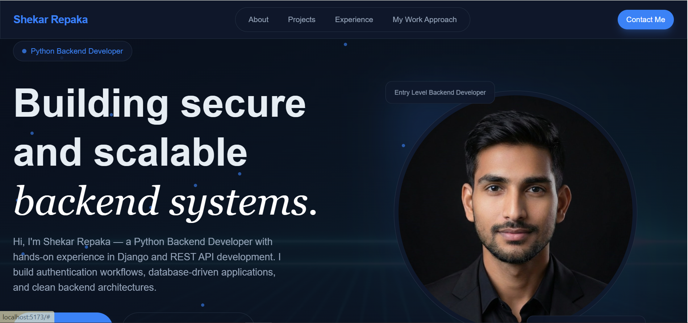

# 👋 Hi, I'm Shekar Repaka

### Python Backend Developer | Django | REST APIs

---

# 🌐 Developer Portfolio

This repository contains my **personal portfolio website** showcasing my backend development skills, projects, and experience.

The portfolio highlights my work with:

- Python
- Django
- Django REST Framework
- REST API Development
- Database-driven applications

---

# 🚀 Live Website

🔗 **Portfolio:**  
https://your-vercel-link.vercel.app

---

# 👨‍💻 About Me

I am a **Python Backend Developer** focused on building **secure, scalable, and maintainable backend systems**.

My experience includes:

- Designing REST APIs using Django REST Framework
- Implementing authentication systems
- Building database-driven applications
- Backend architecture and system design
- API testing using Postman

---

# 🛠 Tech Stack

### Backend
- Python
- Django
- Django REST Framework
- REST APIs

### Database
- MySQL
- SQL

### Frontend
- React
- Vite
- Tailwind CSS
- JavaScript

### Tools
- Git
- GitHub
- Postman
- VS Code

### Cloud / Certification
- Microsoft Azure Fundamentals

---

# 📂 Featured Projects

## 🗳 Smart Online Voting System
Python backend application for secure online voting.

Features:

- User authentication
- Duplicate vote prevention
- Database validation
- Secure backend logic

---

## 🚗 Fast Lane Detection (Attention Mechanism)

Python-based machine learning system for detecting road lanes using attention mechanisms.

Features:

- Image preprocessing
- Lane detection model
- Model evaluation

---

## ✅ Task Manager Application

Backend task management system with Python.

Features:

- CRUD operations
- Task tracking
- Data validation

---

## 🤖 LifeSync AI Agent

Modular Python automation agent designed to manage tasks and workflows.

Features:

- Automation workflows
- Modular architecture
- Version-controlled development

---

---

## 🖥 Portfolio Preview

---

# ⚙️ Run Project Locally

### Clone the repository
git clone https://github.com/RepakaShekar/shekar-portfolio.git

### Navigate to the project
cd shekar-portfolio

### Install dependencies
npm install

### Start development server
npm run dev

Project runs at:
http://localhost:5173

---

# 🚀 Deployment

This portfolio is deployed using **Vercel**.

Deployment process:

1. Push code to GitHub
2. Import repository in Vercel
3. Deploy automatically

---

# 📊 GitHub Stats

## 💻 Most Used Languages

## 📈 GitHub Contribution Graph

---

# 📬 Contact

📧 Email  
repakashekar3@gmail.com  

🔗 LinkedIn  
https://www.linkedin.com/in/shekar-repaka-2314b92a1  

🐙 GitHub  
https://github.com/RepakaShekar  

🐦 X (Twitter)  
https://x.com/shekar_R3  

---

# ⭐ Support

If you like this project, consider giving it a **star ⭐ on GitHub**.

---

# 📜 License

This project is licensed under the **MIT License**.
